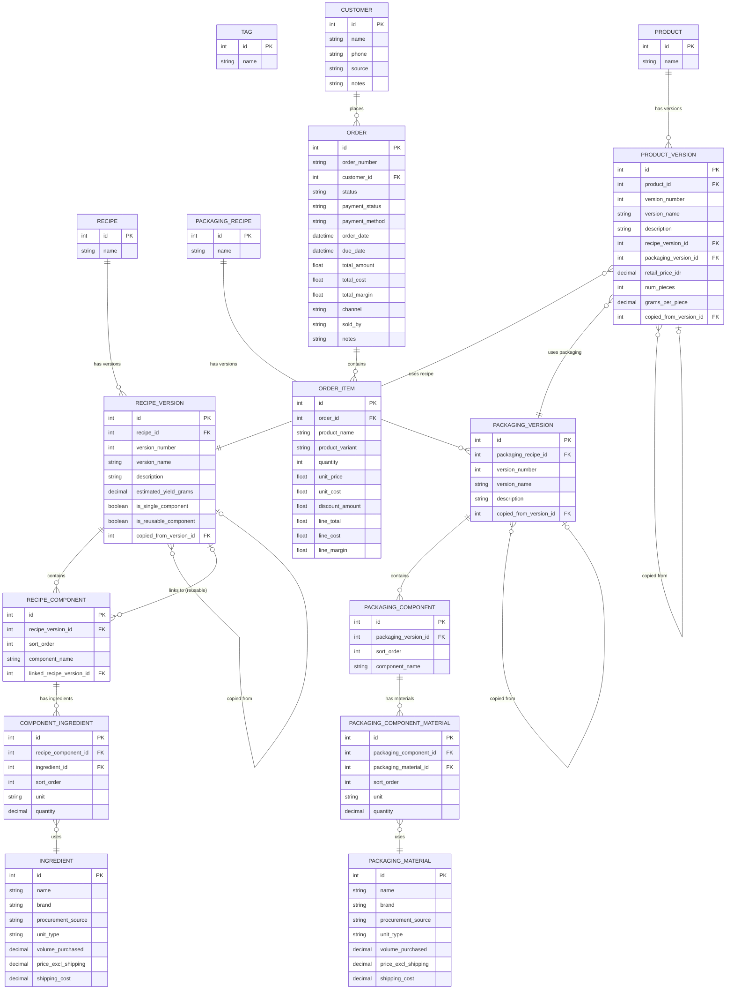

# System Architecture & Reference

## 1. High-Level Architecture

**Request Flow:**

```
User Browser
    ↓
React Router (pages/)
    ↓
React Query Hooks (hooks/)
    ↓
Axios API Client (lib/api.ts)
    ↓ HTTP/JSON
FastAPI Routers (routers/)
    ↓
CRUD Operations (crud/)
    ↓
SQLAlchemy Models (models/)
    ↓
SQLite Database (data/malo_recipes.db)
```

**Layer Responsibilities:**

- **Frontend Pages**: Handle routing, data fetching, user interactions
- **React Query Hooks**: Manage server state, caching, mutations
- **API Client**: HTTP requests with axios, centralized error handling
- **FastAPI Routers**: Endpoint definitions, request validation, response formatting
- **CRUD Layer**: Database queries, relationship loading, business logic
- **Models Layer**: ORM definitions, relationships, constraints
- **Services Layer**: Cross-cutting concerns (cost calculations)

## 2. Technology Stack

| Layer | Technology | Version |
|-------|------------|---------|
| Backend | Python + FastAPI | 3.11+ / 0.109.0 |
| Database | SQLite | 3.x |
| ORM | SQLAlchemy | 2.0.25 |
| Validation | Pydantic | 2.5.3 |
| Frontend | React + TypeScript | 19.2.0 |
| Styling | Tailwind CSS | 4.1.18 |
| UI Components | shadcn/ui (Radix) | latest |
| State | TanStack Query | 5.90.20 |
| Routing | React Router | 7.13.0 |
| HTTP Client | Axios | 1.13.3 |
| Icons | Lucide React | 0.563.0 |

## 3. Database Schema

### Visual Schema Diagram



### Table Definitions (Summarized)

1. **ingredient**: Raw food ingredients (g, kg, ml, l, pcs)
2. **packaging_material**: Raw packaging materials (pcs, m, cm, sheets)
3. **tag**: Categories (Dubai-Snack, etc.)
4. **recipe**: Parent entity for recipes
5. **recipe_version**: Versioned recipe data with yield and lineage
6. **recipe_component**: Components within a recipe (inline or linked)
7. **component_ingredient**: Individual ingredients in a component
8. **recipe_tag**: Junction table
9. **packaging_recipe**: Parent entity for packaging
10. **packaging_version**: Versioned packaging configurations
11. **packaging_component**: Structural components of packaging
12. **packaging_component_material**: Materials used in packaging components
13. **packaging_tag**: Junction table
14. **product**: Parent entity for saleable products
15. **product_version**: Versioned product config linking Recipe + Packaging with COGS
16. **product_tag**: Junction table
17. **customer**: Customer entity for order management
18. **order**: Order entity (standalone, links to customer)
19. **order_item**: Order line items (standalone text-based product link)

---

## Project Structure

```
product_master/
+-- convex/                           # Backend (59 tables)
|   +-- _generated/                   # Auto-generated types & API
|   +-- lib/
|   |   +-- costCalculator.ts         # Cost calculation logic
|   |   +-- auth.ts                   # requireRole() helper
|   +-- auth/                         # Login, sessions, user management
|   +-- channels/                     # Channel usage tracking
|   +-- componentTypes/               # Unified BOM component types
|   +-- customers/                    # Customer CRUD
|   +-- dashboard/                    # Dashboard aggregation queries
|   +-- externalData/                 # External data sync (GoFood, etc.)
|   +-- feedback/                     # Visual feedback overlay
|   +-- gofoodDepot/                  # GoFood depot integration
|   +-- ingredients/                  # Ingredient CRUD
|   +-- integrations/                 # Third-party integrations (GoBiz)
|   +-- integrityChecks/              # Data integrity validation
|   +-- inventory/                    # Inventory batches, stock, transactions
|   +-- k3martCockpit/                # K3Mart cockpit dashboard
|   +-- k3martKitchen/                # K3Mart kitchen operations
|   +-- kitchenConfig/                # Kitchen configuration settings
|   +-- materials/                    # Packaging materials CRUD
|   +-- menuProductComponents/        # Menu product -> component type links
|   +-- menuProducts/                 # Menu product definitions
|   +-- migrations/                   # Data migrations
|   +-- orders/                       # Order management
|   |   +-- queries.ts
|   |   +-- mutations/                # Split: orderCrud, inventoryIntegration
|   |   +-- whatsapp.ts               # WhatsApp message templates
|   |   +-- helpers.ts                # Pure functions (no ctx)
|   |   +-- helpers/                  # Ctx-dependent helpers
|   +-- packaging/                    # Packaging recipes
|   +-- platformCredentials/          # Platform API credentials
|   +-- productionCounts/             # Production counts (archived, read-only)
|   +-- productionLog/                # Production log entries (source of truth)
|   +-- productionTargets/            # Daily production targets
|   +-- productionUnitTypes/          # Production unit types (Big Ball, Mid Ball)
|   +-- products/                     # Product management
|   +-- recipes/                      # Recipe management
|   +-- reports/                      # Report generation
|   +-- restock/                      # Restock planning
|   +-- shipping/                     # Shipping agency tracking
|   +-- storageLocations/             # Storage location CRUD
|   +-- tags/                         # Tag management
|   +-- vouchers/                     # Voucher codes + usage tracking
|   +-- whatsappTemplates/            # Editable WhatsApp templates
|   +-- crons.ts                      # Scheduled jobs
|   +-- http.ts                       # HTTP endpoints
|   +-- schema.ts                     # Database schema
+-- src/                              # Frontend
|   +-- components/
|   |   +-- ui/                       # shadcn/ui primitives
|   |   +-- layout/                   # Header, Layout, PageHeader
|   |   +-- auth/                     # ProtectedRoute, LoginForm
|   |   +-- shared/                   # CostTooltip, ConfirmDialog, FormBuilder, etc.
|   |   +-- (feature folders)
|   +-- pages/                        # Page components
|   +-- hooks/
|   |   +-- convex/                   # Convex query/mutation hooks + index.ts
|   +-- contexts/
|   |   +-- AuthContext.tsx           # Auth state (useAuth)
|   +-- lib/
|   |   +-- types.ts                  # TypeScript interfaces
|   |   +-- utils.ts                  # cn, formatCurrency
|   +-- App.tsx                       # Router setup
|   +-- main.tsx                      # Entry with ConvexProvider
|   +-- index.css                     # Tailwind CSS + theme
+-- docs/                             # Documentation
+-- .claude/agents/                   # Specialized agents
+-- .agent/skills/                    # Custom skills
```

---

## Critical File Paths

**Backend (Convex) — 59 tables in `convex/schema.ts`:**
- `convex/schema.ts` — Database schema definition
- `convex/lib/costCalculator.ts` — Cost calculation logic
- `convex/lib/auth.ts` — `requireRole()` authorization helper
- `convex/orders/whatsapp.ts` — WhatsApp receipt generation
- `convex/orders/helpers.ts` — Pure order calculation helpers (no ctx)
- `convex/orders/helpers/` — Ctx-dependent helpers (ballDistribution, statusTransitions, usageTracking, productionRecords, voucherHandling, batchFetching, statusFetching)
- `convex/orders/mutations/` — Order mutations (split into orderCrud, inventoryIntegration)

**Frontend:**
- `src/App.tsx` — Router setup (all routes use ProtectedRoute)
- `src/main.tsx` — Entry point with ConvexProvider
- `src/contexts/AuthContext.tsx` — Auth state management
- `src/hooks/convex/` — Convex query/mutation hooks
- `src/lib/types.ts` — TypeScript interfaces
- `src/lib/utils.ts` — Utilities (cn, formatCurrency)
- `src/components/auth/ProtectedRoute.tsx` — Route permission guards
