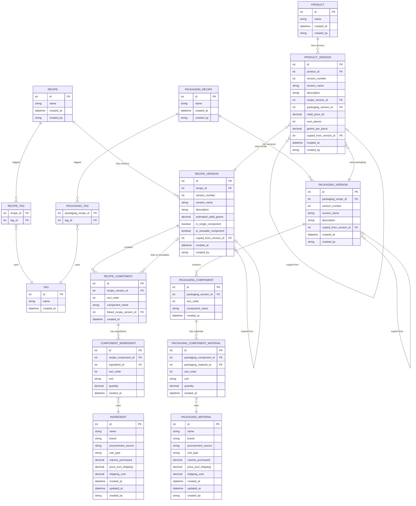

# Recipe & Product Concept Master - PRD

**Version:** 1.0  
**Date:** January 2026  
**Owner:** Admin (placeholder for multi-user)

---

## 1. Entity Relationship Diagram



---

## 2. SQLite Schema

```sql
-- =============================================
-- INGREDIENTS (Food)
-- =============================================
CREATE TABLE ingredient (
    id INTEGER PRIMARY KEY AUTOINCREMENT,
    name TEXT NOT NULL,
    brand TEXT,
    procurement_source TEXT,
    unit_type TEXT NOT NULL DEFAULT 'g',  -- g, kg, ml, l, pcs
    volume_purchased REAL NOT NULL,
    price_excl_shipping REAL NOT NULL,
    shipping_cost REAL DEFAULT 0,
    created_at DATETIME DEFAULT CURRENT_TIMESTAMP,
    updated_at DATETIME DEFAULT CURRENT_TIMESTAMP,
    created_by TEXT DEFAULT 'admin'
);

CREATE INDEX idx_ingredient_name ON ingredient(name);
CREATE INDEX idx_ingredient_brand ON ingredient(brand);

-- =============================================
-- PACKAGING MATERIALS
-- =============================================
CREATE TABLE packaging_material (
    id INTEGER PRIMARY KEY AUTOINCREMENT,
    name TEXT NOT NULL,
    brand TEXT,
    procurement_source TEXT,
    unit_type TEXT NOT NULL DEFAULT 'pcs',  -- pcs, m, cm, sheets
    volume_purchased REAL NOT NULL,
    price_excl_shipping REAL NOT NULL,
    shipping_cost REAL DEFAULT 0,
    created_at DATETIME DEFAULT CURRENT_TIMESTAMP,
    updated_at DATETIME DEFAULT CURRENT_TIMESTAMP,
    created_by TEXT DEFAULT 'admin'
);

CREATE INDEX idx_packaging_material_name ON packaging_material(name);

-- =============================================
-- TAGS
-- =============================================
CREATE TABLE tag (
    id INTEGER PRIMARY KEY AUTOINCREMENT,
    name TEXT NOT NULL UNIQUE,
    created_at DATETIME DEFAULT CURRENT_TIMESTAMP
);

-- Seed default tags
INSERT INTO tag (name) VALUES 
    ('Dubai-Snack'),
    ('Extruded-Snack'),
    ('Sachet'),
    ('Pouch'),
    ('Box');

-- =============================================
-- RECIPES
-- =============================================
CREATE TABLE recipe (
    id INTEGER PRIMARY KEY AUTOINCREMENT,
    name TEXT NOT NULL,
    created_at DATETIME DEFAULT CURRENT_TIMESTAMP,
    created_by TEXT DEFAULT 'admin'
);

CREATE INDEX idx_recipe_name ON recipe(name);

CREATE TABLE recipe_version (
    id INTEGER PRIMARY KEY AUTOINCREMENT,
    recipe_id INTEGER NOT NULL,
    version_number INTEGER NOT NULL,
    version_name TEXT NOT NULL,
    description TEXT,
    estimated_yield_grams REAL,
    is_single_component INTEGER DEFAULT 0,  -- boolean: 1 if recipe has exactly 1 component
    is_reusable_component INTEGER DEFAULT 0,  -- boolean: 1 if user marked as reusable
    copied_from_version_id INTEGER,
    created_at DATETIME DEFAULT CURRENT_TIMESTAMP,
    created_by TEXT DEFAULT 'admin',
    FOREIGN KEY (recipe_id) REFERENCES recipe(id) ON DELETE CASCADE,
    FOREIGN KEY (copied_from_version_id) REFERENCES recipe_version(id),
    UNIQUE(recipe_id, version_number)
);

CREATE INDEX idx_recipe_version_recipe ON recipe_version(recipe_id);

CREATE TABLE recipe_component (
    id INTEGER PRIMARY KEY AUTOINCREMENT,
    recipe_version_id INTEGER NOT NULL,
    sort_order INTEGER NOT NULL DEFAULT 0,
    component_name TEXT NOT NULL,
    linked_recipe_version_id INTEGER,  -- NULL if inline component, FK if using reusable
    created_at DATETIME DEFAULT CURRENT_TIMESTAMP,
    FOREIGN KEY (recipe_version_id) REFERENCES recipe_version(id) ON DELETE CASCADE,
    FOREIGN KEY (linked_recipe_version_id) REFERENCES recipe_version(id)
);

CREATE INDEX idx_recipe_component_version ON recipe_component(recipe_version_id);
CREATE INDEX idx_recipe_component_linked ON recipe_component(linked_recipe_version_id);

CREATE TABLE component_ingredient (
    id INTEGER PRIMARY KEY AUTOINCREMENT,
    recipe_component_id INTEGER NOT NULL,
    ingredient_id INTEGER NOT NULL,
    sort_order INTEGER NOT NULL DEFAULT 0,
    unit TEXT NOT NULL DEFAULT 'g',  -- g, kg, ml, l, pcs
    quantity REAL NOT NULL,
    created_at DATETIME DEFAULT CURRENT_TIMESTAMP,
    FOREIGN KEY (recipe_component_id) REFERENCES recipe_component(id) ON DELETE CASCADE,
    FOREIGN KEY (ingredient_id) REFERENCES ingredient(id)
);

CREATE INDEX idx_component_ingredient_component ON component_ingredient(recipe_component_id);

CREATE TABLE recipe_tag (
    recipe_id INTEGER NOT NULL,
    tag_id INTEGER NOT NULL,
    PRIMARY KEY (recipe_id, tag_id),
    FOREIGN KEY (recipe_id) REFERENCES recipe(id) ON DELETE CASCADE,
    FOREIGN KEY (tag_id) REFERENCES tag(id) ON DELETE CASCADE
);

-- =============================================
-- PACKAGING RECIPES
-- =============================================
CREATE TABLE packaging_recipe (
    id INTEGER PRIMARY KEY AUTOINCREMENT,
    name TEXT NOT NULL,
    created_at DATETIME DEFAULT CURRENT_TIMESTAMP,
    created_by TEXT DEFAULT 'admin'
);

CREATE INDEX idx_packaging_recipe_name ON packaging_recipe(name);

CREATE TABLE packaging_version (
    id INTEGER PRIMARY KEY AUTOINCREMENT,
    packaging_recipe_id INTEGER NOT NULL,
    version_number INTEGER NOT NULL,
    version_name TEXT NOT NULL,
    description TEXT,
    copied_from_version_id INTEGER,
    created_at DATETIME DEFAULT CURRENT_TIMESTAMP,
    created_by TEXT DEFAULT 'admin',
    FOREIGN KEY (packaging_recipe_id) REFERENCES packaging_recipe(id) ON DELETE CASCADE,
    FOREIGN KEY (copied_from_version_id) REFERENCES packaging_version(id),
    UNIQUE(packaging_recipe_id, version_number)
);

CREATE INDEX idx_packaging_version_recipe ON packaging_version(packaging_recipe_id);

CREATE TABLE packaging_component (
    id INTEGER PRIMARY KEY AUTOINCREMENT,
    packaging_version_id INTEGER NOT NULL,
    sort_order INTEGER NOT NULL DEFAULT 0,
    component_name TEXT NOT NULL,
    created_at DATETIME DEFAULT CURRENT_TIMESTAMP,
    FOREIGN KEY (packaging_version_id) REFERENCES packaging_version(id) ON DELETE CASCADE
);

CREATE INDEX idx_packaging_component_version ON packaging_component(packaging_version_id);

CREATE TABLE packaging_component_material (
    id INTEGER PRIMARY KEY AUTOINCREMENT,
    packaging_component_id INTEGER NOT NULL,
    packaging_material_id INTEGER NOT NULL,
    sort_order INTEGER NOT NULL DEFAULT 0,
    unit TEXT NOT NULL DEFAULT 'pcs',
    quantity REAL NOT NULL,
    created_at DATETIME DEFAULT CURRENT_TIMESTAMP,
    FOREIGN KEY (packaging_component_id) REFERENCES packaging_component(id) ON DELETE CASCADE,
    FOREIGN KEY (packaging_material_id) REFERENCES packaging_material(id)
);

CREATE INDEX idx_pcm_component ON packaging_component_material(packaging_component_id);

CREATE TABLE packaging_tag (
    packaging_recipe_id INTEGER NOT NULL,
    tag_id INTEGER NOT NULL,
    PRIMARY KEY (packaging_recipe_id, tag_id),
    FOREIGN KEY (packaging_recipe_id) REFERENCES packaging_recipe(id) ON DELETE CASCADE,
    FOREIGN KEY (tag_id) REFERENCES tag(id) ON DELETE CASCADE
);

-- =============================================
-- PRODUCTS
-- =============================================
CREATE TABLE product (
    id INTEGER PRIMARY KEY AUTOINCREMENT,
    name TEXT NOT NULL,
    created_at DATETIME DEFAULT CURRENT_TIMESTAMP,
    created_by TEXT DEFAULT 'admin'
);

CREATE INDEX idx_product_name ON product(name);

CREATE TABLE product_version (
    id INTEGER PRIMARY KEY AUTOINCREMENT,
    product_id INTEGER NOT NULL,
    version_number INTEGER NOT NULL,
    version_name TEXT NOT NULL,
    description TEXT,
    recipe_version_id INTEGER NOT NULL,
    packaging_version_id INTEGER NOT NULL,
    retail_price_idr REAL NOT NULL,
    num_pieces INTEGER NOT NULL DEFAULT 1,
    grams_per_piece REAL NOT NULL,
    copied_from_version_id INTEGER,
    created_at DATETIME DEFAULT CURRENT_TIMESTAMP,
    created_by TEXT DEFAULT 'admin',
    FOREIGN KEY (product_id) REFERENCES product(id) ON DELETE CASCADE,
    FOREIGN KEY (recipe_version_id) REFERENCES recipe_version(id),
    FOREIGN KEY (packaging_version_id) REFERENCES packaging_version(id),
    FOREIGN KEY (copied_from_version_id) REFERENCES product_version(id),
    UNIQUE(product_id, version_number)
);

CREATE INDEX idx_product_version_product ON product_version(product_id);
CREATE INDEX idx_product_version_recipe ON product_version(recipe_version_id);
CREATE INDEX idx_product_version_packaging ON product_version(packaging_version_id);
```

---

## 3. Calculated Field Formulas

### 3.1 Ingredient Cost Per Base Unit

```sql
-- Cost per gram (for g/kg) or per ml (for ml/l) or per piece
-- Normalizes to smallest unit for calculations

SELECT 
    id,
    name,
    CASE 
        WHEN unit_type = 'kg' THEN (price_excl_shipping + shipping_cost) / (volume_purchased * 1000)
        WHEN unit_type = 'l' THEN (price_excl_shipping + shipping_cost) / (volume_purchased * 1000)
        ELSE (price_excl_shipping + shipping_cost) / volume_purchased
    END AS cost_per_base_unit,
    CASE 
        WHEN unit_type IN ('kg', 'g') THEN 'g'
        WHEN unit_type IN ('l', 'ml') THEN 'ml'
        ELSE 'pcs'
    END AS base_unit
FROM ingredient;
```

### 3.2 Component Total Cost

```sql
-- For a single component, sum all ingredient costs
-- Converts quantity to base units first

SELECT 
    rc.id AS component_id,
    rc.component_name,
    SUM(
        ci.quantity * 
        CASE 
            WHEN ci.unit = 'kg' THEN 1000
            WHEN ci.unit = 'l' THEN 1000
            ELSE 1
        END *
        CASE 
            WHEN i.unit_type = 'kg' THEN (i.price_excl_shipping + i.shipping_cost) / (i.volume_purchased * 1000)
            WHEN i.unit_type = 'l' THEN (i.price_excl_shipping + i.shipping_cost) / (i.volume_purchased * 1000)
            ELSE (i.price_excl_shipping + i.shipping_cost) / i.volume_purchased
        END
    ) AS component_cost_idr
FROM recipe_component rc
JOIN component_ingredient ci ON ci.recipe_component_id = rc.id
JOIN ingredient i ON i.id = ci.ingredient_id
WHERE rc.recipe_version_id = ?
GROUP BY rc.id;
```

### 3.3 Recipe Version Total Cost

```sql
-- Sum of all components in a recipe version
-- Handles both inline and linked components

WITH component_costs AS (
    SELECT 
        rc.recipe_version_id,
        rc.id AS component_id,
        CASE 
            WHEN rc.linked_recipe_version_id IS NOT NULL THEN
                -- Linked component: get cost from source recipe
                (SELECT SUM(
                    ci2.quantity * 
                    CASE WHEN ci2.unit IN ('kg', 'l') THEN 1000 ELSE 1 END *
                    CASE 
                        WHEN i2.unit_type IN ('kg', 'l') THEN (i2.price_excl_shipping + i2.shipping_cost) / (i2.volume_purchased * 1000)
                        ELSE (i2.price_excl_shipping + i2.shipping_cost) / i2.volume_purchased
                    END
                )
                FROM recipe_component rc2
                JOIN component_ingredient ci2 ON ci2.recipe_component_id = rc2.id
                JOIN ingredient i2 ON i2.id = ci2.ingredient_id
                WHERE rc2.recipe_version_id = rc.linked_recipe_version_id)
            ELSE
                -- Inline component
                (SELECT SUM(
                    ci.quantity * 
                    CASE WHEN ci.unit IN ('kg', 'l') THEN 1000 ELSE 1 END *
                    CASE 
                        WHEN i.unit_type IN ('kg', 'l') THEN (i.price_excl_shipping + i.shipping_cost) / (i.volume_purchased * 1000)
                        ELSE (i.price_excl_shipping + i.shipping_cost) / i.volume_purchased
                    END
                )
                FROM component_ingredient ci
                JOIN ingredient i ON i.id = ci.ingredient_id
                WHERE ci.recipe_component_id = rc.id)
        END AS cost
    FROM recipe_component rc
)
SELECT 
    recipe_version_id,
    SUM(cost) AS total_recipe_cost_idr
FROM component_costs
WHERE recipe_version_id = ?
GROUP BY recipe_version_id;
```

### 3.4 Recipe Cost Per Gram

```sql
-- Requires estimated_yield_grams to be set on recipe_version

SELECT 
    rv.id,
    rv.version_name,
    rv.estimated_yield_grams,
    (SELECT SUM(component_cost) FROM ...) AS total_cost,
    (SELECT SUM(component_cost) FROM ...) / rv.estimated_yield_grams AS cost_per_gram
FROM recipe_version rv
WHERE rv.id = ?;
```

### 3.5 Product COGS Calculation

```sql
-- Product COGS = (recipe_cost_per_gram * total_grams) + packaging_cost

SELECT 
    pv.id AS product_version_id,
    pv.version_name,
    pv.retail_price_idr,
    pv.num_pieces,
    pv.grams_per_piece,
    (pv.num_pieces * pv.grams_per_piece) AS total_grams,
    
    -- Recipe COGS
    (
        SELECT SUM(component_cost) / rv.estimated_yield_grams
        FROM ... 
        WHERE recipe_version_id = pv.recipe_version_id
    ) * (pv.num_pieces * pv.grams_per_piece) AS recipe_cogs,
    
    -- Packaging COGS
    (
        SELECT SUM(
            pcm.quantity *
            CASE 
                WHEN pm.unit_type IN ('m') THEN (pm.price_excl_shipping + pm.shipping_cost) / (pm.volume_purchased * 100)
                ELSE (pm.price_excl_shipping + pm.shipping_cost) / pm.volume_purchased
            END
        )
        FROM packaging_component pc
        JOIN packaging_component_material pcm ON pcm.packaging_component_id = pc.id
        JOIN packaging_material pm ON pm.id = pcm.packaging_material_id
        WHERE pc.packaging_version_id = pv.packaging_version_id
    ) AS packaging_cogs,
    
    -- Contribution Margin
    pv.retail_price_idr - recipe_cogs - packaging_cogs AS contribution_margin_idr,
    
    -- Contribution Margin %
    ((pv.retail_price_idr - recipe_cogs - packaging_cogs) / pv.retail_price_idr) * 100 AS contribution_margin_pct

FROM product_version pv
WHERE pv.id = ?;
```

---

## 4. UI Flow Summary

### 4.1 Dashboard (Landing Page)

```
┌─────────────────────────────────────────────────────────────────┐
│  RECIPE & PRODUCT MASTER                                        │
├─────────────────────────────────────────────────────────────────┤
│  Quick Stats (cards):                                           │
│  ┌──────────┐ ┌──────────┐ ┌──────────┐ ┌──────────┐           │
│  │ 24       │ │ Caramel  │ │ Pouch A  │ │ IDR 4,200│           │
│  │ Recipes  │ │ Coating  │ │ Most Used│ │ Avg COGS │           │
│  └──────────┘ └──────────┘ └──────────┘ └──────────┘           │
│                                                                 │
│  PRODUCTS ─────────────────────────────────────────────────────│
│  ┌─────────┐ ┌─────────┐ ┌─────────┐ ┌─────────┐ ┌─────────┐  │
│  │ + New   │ │ Dubai   │ │ Caramel │ │ Corn    │ │   >>>   │  │
│  │ Product │ │ Cookie  │ │ Puff    │ │ Stick   │ │         │  │
│  └─────────┘ └─────────┘ └─────────┘ └─────────┘ └─────────┘  │
│                                        ↑ hover shows tooltip    │
│  RECIPES ──────────────────────────────────────────────────────│
│  ┌─────────┐ ┌─────────┐ ┌─────────┐ ┌─────────┐ ┌─────────┐  │
│  │ + New   │ │Pistachio│ │ Caramel │ │ Cookie  │ │   >>>   │  │
│  │ Recipe  │ │ Filling │ │ Coating │ │ Dough   │ │         │  │
│  └─────────┘ └─────────┘ └─────────┘ └─────────┘ └─────────┘  │
│                                                                 │
│  PACKAGING ────────────────────────────────────────────────────│
│  ┌─────────┐ ┌─────────┐ ┌─────────┐ ┌─────────┐ ┌─────────┐  │
│  │ + New   │ │ Pouch A │ │ Box +   │ │ Sachet  │ │   >>>   │  │
│  │ Package │ │         │ │ Sticker │ │ Simple  │ │         │  │
│  └─────────┘ └─────────┘ └─────────┘ └─────────┘ └─────────┘  │
└─────────────────────────────────────────────────────────────────┘
```

**Tooltip Behavior:**
- Hover on any card shows: Latest version, description, created date, total cost
- Click opens editor for that item

### 4.2 Recipe Editor

```
┌─────────────────────────────────────────────────────────────────┐
│  ← Back to Dashboard                                            │
├─────────────────────────────────────────────────────────────────┤
│  Dubai Cookie                                    [Tags: Dubai▼] │
│  ┌────┐                      ┌────┐                             │
│  │ ←  │  Version 3 - Final   │ →  │  [+ New Version]            │
│  └────┘  Created: 24 Jan 2026 14:32                             │
│          Copied from: Version 2                                 │
│                                                                 │
│  Description: Added more pistachio, reduced sugar               │
│  Estimated Yield: [450] grams                                   │
│                                                                 │
│  ─── COMPONENTS ───────────────────────────────────────────────│
│                                                                 │
│  ┌─ Pistachio Filling (i) ────────────────────────── [↑][↓][×]─┐│
│  │  🔗 Linked: Pistachio Filling v2  [Change Version ▼]        ││
│  │     View Source | Edit (creates new version)                 ││
│  │  ─────────────────────────────────────────────────────────  ││
│  │  Ingredient         Brand      Unit    Qty    Cost (i)      ││
│  │  ┌─────────────────────────────────────────────────────┐    ││
│  │  │ Pistachios       Kirkland    g      200    IDR 48,000│   ││
│  │  │ Sugar            Gulaku      g       50    IDR  1,200│   ││
│  │  │ Butter           Anchor      g       30    IDR  4,500│   ││
│  │  └─────────────────────────────────────────────────────┘    ││
│  │  [+ Add Ingredient]               Subtotal: IDR 53,700      ││
│  └─────────────────────────────────────────────────────────────┘│
│                                                                 │
│  ┌─ Cookie Shell ─────────────────────────────────── [↑][↓][×]─┐│
│  │  Ingredient         Brand      Unit    Qty    Cost (i)      ││
│  │  ┌─────────────────────────────────────────────────────┐    ││
│  │  │ Flour            Segitiga    g      300    IDR  3,600│   ││
│  │  │ Butter           Anchor      g      150    IDR 22,500│   ││
│  │  │ Egg              Local       pcs      2    IDR  6,000│   ││
│  │  └─────────────────────────────────────────────────────┘    ││
│  │  [+ Add Ingredient]               Subtotal: IDR 32,100      ││
│  └─────────────────────────────────────────────────────────────┘│
│                                                                 │
│  [+ Add Component]  [+ Add Existing Component]                  │
│                                                                 │
│  ─── SUMMARY ──────────────────────────────────────────────────│
│  Total Recipe Cost: IDR 85,800                                  │
│  Cost per Gram: IDR 190.67                                      │
│                                                                 │
│  [ ] Mark as Reusable Component (only if single component)      │
│                                                                 │
│  [Cancel]                              [Save Version] (locked)  │
└─────────────────────────────────────────────────────────────────┘
```

**Interaction Details:**

- **(i) icons**: Hover shows full details (procurement source, shipping, price breakdown)
- **Version arrows**: Left disabled at v1, right becomes "+ New Version" at latest
- **Linked component**: Shows source version, dropdown to change, edit triggers new version creation with warning
- **Ingredient row**: Combobox search, inline edit opens modal for ingredient details
- **Reorder**: Drag or arrow buttons for both components and ingredient rows

### 4.3 Version Copy Modal

```
┌─────────────────────────────────────────────────────────────────┐
│  Create New Version                                             │
├─────────────────────────────────────────────────────────────────┤
│  Copying from: Version 3 - Final                                │
│                                                                 │
│  New Version Name: [Version 4 - _______________]                │
│                                                                 │
│  Description (required):                                        │
│  ┌─────────────────────────────────────────────────────────┐   │
│  │                                                          │   │
│  │                                                          │   │
│  └─────────────────────────────────────────────────────────┘   │
│                                                                 │
│  [Cancel]                                      [Create Version] │
└─────────────────────────────────────────────────────────────────┘
```

### 4.4 Linked Component Edit Warning

```
┌─────────────────────────────────────────────────────────────────┐
│  ⚠️ Edit Linked Component                                       │
├─────────────────────────────────────────────────────────────────┤
│  You are editing "Pistachio Filling" which is used in:          │
│                                                                 │
│  • Dubai Cookie (v2, v3)                                        │
│  • Pistachio Croissant (v1)                                     │
│                                                                 │
│  Saving will create a NEW VERSION of Pistachio Filling.         │
│  This recipe will auto-update to use the new version.           │
│  Other recipes above will NOT be affected.                      │
│                                                                 │
│  [Cancel]                     [Continue to Edit]                │
└─────────────────────────────────────────────────────────────────┘
```

### 4.5 Product Concept Editor

```
┌─────────────────────────────────────────────────────────────────┐
│  ← Back to Dashboard                                            │
├─────────────────────────────────────────────────────────────────┤
│  Dubai Cookie 45g x 3                                           │
│  ┌────┐                      ┌────┐                             │
│  │ ←  │  Version 2 - Launch  │ →  │                             │
│  └────┘  Created: 25 Jan 2026 09:15                             │
│                                                                 │
│  Description: Final launch config with premium box              │
│                                                                 │
│  ─── RECIPE ───────────────────────────────────────────────────│
│  Selected: Dubai Cookie                                         │
│  Version:  [v3 - Final                    ▼]                    │
│            Yield: 450g | Cost: IDR 85,800                       │
│                                                                 │
│  ─── PACKAGING ────────────────────────────────────────────────│
│  Selected: Premium Box + Sticker                                │
│  Version:  [v2 - Gold foil               ▼]                     │
│            Cost: IDR 4,500                                      │
│                                                                 │
│  ─── PRODUCT CONFIG ───────────────────────────────────────────│
│  Pieces per Package:    [3]                                     │
│  Grams per Piece:       [45]                                    │
│  ─────────────────────────────────                              │
│  Total Grammage:        135g                                    │
│                                                                 │
│  Retail Price (IDR):    [35,000]                                │
│                                                                 │
│  ─── MARGIN CALCULATION ───────────────────────────────────────│
│  ┌─────────────────────────────────────────────────────────┐   │
│  │ Recipe COGS      (135g × IDR 190.67/g)    IDR 25,740    │   │
│  │ Packaging COGS                             IDR  4,500    │   │
│  │ ─────────────────────────────────────────────────────── │   │
│  │ Total COGS                                 IDR 30,240    │   │
│  │ Retail Price                               IDR 35,000    │   │
│  │ ─────────────────────────────────────────────────────── │   │
│  │ CONTRIBUTION MARGIN                        IDR  4,760    │   │
│  │ CONTRIBUTION MARGIN %                          13.6%     │   │
│  └─────────────────────────────────────────────────────────┘   │
│                                                                 │
│  [Cancel]                              [Save Version] (locked)  │
└─────────────────────────────────────────────────────────────────┘
```

---

## 5. Edge Cases & Business Rules

### 5.1 Versioning Rules

| Rule | Behavior |
|------|----------|
| Version immutability | Once saved, a version cannot be edited. User must create new version. |
| Version numbering | Strictly sequential (1, 2, 3...). No branching. |
| Copy source | Any historical version can be copied to create the next version number. |
| Delete version | Not allowed. Versions are permanent audit trail. |
| Delete recipe | Warning required. Cascades to all versions. Blocked if used in products. |

### 5.2 Linked Component Rules

| Rule | Behavior |
|------|----------|
| Eligibility | Only single-component recipes marked `is_reusable_component = 1` appear in "Add Existing Component" dropdown. |
| Version selection | When adding linked component, user chooses which version to link. |
| Inline edit | Editing a linked component inline triggers new version creation of source recipe. |
| Auto-update | After inline edit, current recipe auto-updates to new component version. Other recipes stay on their selected versions. |
| Impact warning | Before edit, show list of all recipes using this component. |

### 5.3 Unit Conversion Rules

| From | To | Conversion |
|------|----|------------|
| kg | g | × 1000 |
| g | g | × 1 |
| l | ml | × 1000 |
| ml | ml | × 1 |
| ml | g | × 1 (assumed for liquid ingredients) |
| pcs | pcs | × 1 |

**Business Rule:** Final product weight is always expressed in grams. For liquid ingredients, assume 1 ml = 1 g for COGS calculations. This approximation is acceptable for snack products where liquid ingredients (oils, water) are minor components.

### 5.4 COGS Calculation Rules

| Rule | Formula |
|------|---------|
| Ingredient cost | `(price_excl_shipping + shipping_cost) / volume_purchased_in_base_units` |
| Component cost | Sum of (ingredient_cost × quantity_in_base_units) for all ingredients |
| Recipe cost | Sum of all component costs |
| Cost per gram | `recipe_cost / estimated_yield_grams` |
| Product recipe COGS | `cost_per_gram × (num_pieces × grams_per_piece)` |
| Product total COGS | `recipe_cogs + packaging_cogs` |
| Contribution margin | `retail_price - total_cogs` |

### 5.5 Tag Rules

| Rule | Behavior |
|------|----------|
| Tag creation | New tags can be created inline when tagging a recipe/packaging |
| Tag deletion | Only allowed if no recipes/packages use it |
| Tag scope | Tags are shared across recipes and packaging |
| Required | Tags are optional, recipes can have 0 or many tags |

### 5.6 Validation Rules

| Entity | Validation |
|--------|------------|
| Recipe | Must have ≥1 component |
| Component | Must have ≥1 ingredient |
| Ingredient quantity | Must be > 0 |
| Product | Must have recipe and packaging selected |
| Product grams_per_piece | Must be > 0 |
| Product num_pieces | Must be ≥ 1 |
| Version description | Required when creating new version |

---

## 6. Dashboard Statistics Queries

### Total Counts

```sql
SELECT 
    (SELECT COUNT(*) FROM recipe) AS total_recipes,
    (SELECT COUNT(*) FROM packaging_recipe) AS total_packaging,
    (SELECT COUNT(*) FROM product) AS total_products;
```

### Most Used Recipe (as component + in products)

```sql
SELECT 
    r.name,
    (
        SELECT COUNT(*) FROM recipe_component rc 
        WHERE rc.linked_recipe_version_id IN (
            SELECT id FROM recipe_version WHERE recipe_id = r.id
        )
    ) + (
        SELECT COUNT(*) FROM product_version pv 
        WHERE pv.recipe_version_id IN (
            SELECT id FROM recipe_version WHERE recipe_id = r.id
        )
    ) AS usage_count
FROM recipe r
ORDER BY usage_count DESC
LIMIT 1;
```

### Most Used Packaging

```sql
SELECT 
    pr.name,
    (
        SELECT COUNT(*) FROM product_version pv 
        WHERE pv.packaging_version_id IN (
            SELECT id FROM packaging_version WHERE packaging_recipe_id = pr.id
        )
    ) AS usage_count
FROM packaging_recipe pr
ORDER BY usage_count DESC
LIMIT 1;
```

### Average COGS Per Recipe

```sql
-- Returns average total cost across all latest recipe versions
WITH latest_versions AS (
    SELECT recipe_id, MAX(version_number) AS max_v
    FROM recipe_version
    GROUP BY recipe_id
),
recipe_costs AS (
    SELECT 
        rv.id,
        (
            SELECT COALESCE(SUM(
                ci.quantity * 
                CASE WHEN ci.unit IN ('kg', 'l') THEN 1000 ELSE 1 END *
                CASE 
                    WHEN i.unit_type IN ('kg', 'l') THEN (i.price_excl_shipping + i.shipping_cost) / (i.volume_purchased * 1000)
                    ELSE (i.price_excl_shipping + i.shipping_cost) / i.volume_purchased
                END
            ), 0)
            FROM recipe_component rc
            JOIN component_ingredient ci ON ci.recipe_component_id = rc.id
            JOIN ingredient i ON i.id = ci.ingredient_id
            WHERE rc.recipe_version_id = rv.id
        ) AS total_cost
    FROM recipe_version rv
    JOIN latest_versions lv ON lv.recipe_id = rv.recipe_id AND lv.max_v = rv.version_number
)
SELECT AVG(total_cost) AS avg_recipe_cogs FROM recipe_costs;
```

### Highest COGS Product

```sql
-- Similar pattern with product COGS calculation
-- Returns product with highest total COGS from latest versions
```

---

## 7. Tech Stack Recommendation

| Layer | Technology |
|-------|------------|
| Database | SQLite (local file) |
| Backend | Python + FastAPI or Flask |
| ORM | SQLAlchemy |
| Frontend | React + TypeScript |
| UI Components | shadcn/ui or Radix |
| State | React Query (TanStack Query) |
| Local storage | SQLite file in app data directory |

**Alternative (simpler):** Streamlit for rapid prototyping with Python-only stack.

---

## 8. File Structure (Python/FastAPI)

```
malo-recipe-master/
├── app/
│   ├── __init__.py
│   ├── main.py              # FastAPI app entry
│   ├── database.py          # SQLite connection
│   ├── models/
│   │   ├── __init__.py
│   │   ├── ingredient.py
│   │   ├── recipe.py
│   │   ├── packaging.py
│   │   └── product.py
│   ├── schemas/
│   │   ├── __init__.py
│   │   └── ...              # Pydantic models
│   ├── crud/
│   │   ├── __init__.py
│   │   └── ...              # CRUD operations
│   └── routers/
│       ├── __init__.py
│       ├── recipes.py
│       ├── packaging.py
│       └── products.py
├── frontend/                 # React app
├── data/
│   └── malo_recipes.db      # SQLite database
├── requirements.txt
└── README.md
```

---

## Appendix A: Sample Data

```sql
-- Sample ingredient
INSERT INTO ingredient (name, brand, procurement_source, unit_type, volume_purchased, price_excl_shipping, shipping_cost)
VALUES ('Pistachios (Roasted, Unsalted)', 'Kirkland', 'Costco AU via friend', 'kg', 1.0, 240000, 50000);

-- Sample tag
-- Already seeded above

-- Sample recipe
INSERT INTO recipe (name) VALUES ('Pistachio Filling');
INSERT INTO recipe_version (recipe_id, version_number, version_name, description, estimated_yield_grams, is_single_component, is_reusable_component)
VALUES (1, 1, 'Version 1 - Initial', 'First attempt at pistachio paste', 250, 1, 1);

INSERT INTO recipe_component (recipe_version_id, sort_order, component_name)
VALUES (1, 1, 'Pistachio Paste');

INSERT INTO component_ingredient (recipe_component_id, ingredient_id, sort_order, unit, quantity)
VALUES (1, 1, 1, 'g', 200);
```

---

*End of PRD*
